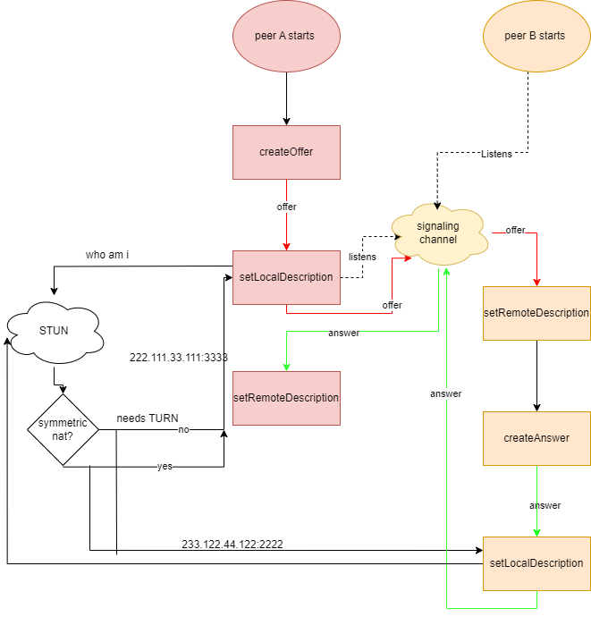

# Communicating Between Java Applications Using WebRTC Data Channels

## Motivation

Recently, I was working on a team project, [Course Clash](https://github.com/404Haze/CourseClash),
for my software design course. This project aims to be an educational
flashcard/quiz-based application designed to help students study course material
more efficiently through fun and engaging gameplay.
Users can browse study sets, play timed quizzes, compete on leaderboards,
and track their performance over time.

One of the use cases that I was assigned to was the multiplayer game play. Which
involves having two users answering the same set of questions simultaneously.
This features gives rise to a few issues. For example, states on both screens have
to be synchornized, requiring both ends to constantly exchange messages to keep the
other side up to date. I then consider a few possible implementations.

Firstly, the synchornized requirement makes the traditional client to server model
ineffective, since requests can only be sent from a client to the server.
Each side has to periodically send a request to the server to get the updated information:

```
client --------------------- server --------------------- client
        data:updated_info ->             <- data:get_update
                                        response:updated_info ->
```

Ideally, we want something like this, where the server can directly push data
to the client and fire an event on the client. A possible implementation is
using websockets, allowing both ends to maintain a connection to the server and
listen to data sent through the socket.

```
client --------------------- server --------------------- client
        data:updated_info ->          data:updated_info ->
```

The server has its benefits such as being more scalable, allowing for more than two
connected clients. But for our use case, only two players are involved.
So, why don't we get rid of the server altogether:

```
client --------------------- client
        data:updated_info ->
```

And WebRTC gives us tools for exactly this.

## Connection Establishment Process

Lets say Alice and Bob wants to connect. Alice will be the one initializing, and
Bob will be the the one responding.

1. _Alice_ calls `alice.createOffer()` to create an SDP (Session Description Protocol) blob (string) describing the connection we want to make.
   This method accepts, optionally, an object with constraints to be met for the connection to meet your needs, such as whether the
   connection should support audio, video, or both. Since we only need to use data channels, we don't have any constraints.
2. If the offer is created successfully, we pass the SDP data along to the _Alice_'s `alice.setLocalDescription(aliceSDP)` method.
   This configures the local (_Alice's)_ end of the connection.
3. After setting the local description, _Alice_ begins to asks STUN servers to generate the ICE candidates, initiating **ICE gathering**.
4. The next step is tell the remote peer, _Bob_, about _Alice's_ connection info.
   This is done by sending _Alice's_ SDP to the _Bob_ through some mean of data transfer, such as a server
   (this process is called **signaling**)
5. Once _Bob_ recieves _Alice's_ SDP data, _Bob_ calls its `bob.setRemoteDescription(aliceSDP)`.
   Now the remote knows about the connection that's being built. (Remember, to _Bob_, _Alice_ is the remote)
6. Now it's time for _Bob_ to reply. _Bob_ calls its `bob.createAnswer()` method to create a response SDP.
   This method processes the recieved (_Alice's_) connection info and use it to
   generates the SDP which describes a connection that both peer supports.
7. If the answer is successfully created, _Bob_ calls his `bob.setLocalDescription(bobSDP)`,
   which configures the _Bob's_ end of the connection (Even though _Bob_ is the remote, but _Bob_'s responce is its local connection info).
8. _Bob_ begins ICE gathering for his end of the connection.
9. Now, _Bob_ must send tbe response SDP back to _Alice_ through the signaling channel.
10. Once _Alice_ recieves _Bob's_ response, _Alice_ sets the remote description by calling `alice.setRemoteDescription(bobSDP)`.

Notes:

- Step 3: at this point, we can choose to wait for at least one candidate connection info to arrive before sending the connection info, or
  send the SDP over without the candidates and keep sending as candidates arrive, (called tricking ICE). Usually it is fine to wait since
  it takes a while for the remote and the signaling server to get ready. Think of joining a meeting, the host has to join first, then get his
  email opened before he could send the meeting code to his participants.
- STUN servers are used to discover the public IP and port mappings for a device behind a NAT.
  This is essential for establishing peer-to-peer connections over the internet.
  If both peers are behind symmetric NATs, a TURN server may be required to relay the traffic.
  The ICE candidates generated during the ICE gathering process include information about possible
  needs to use a TURN server. The address of STUN/TURN servers are usually provided during the
  creation of the `RTCPeerConnection` object.
- ICE (Interactive Connectivity Establishment) candidates provide information about
  the address of the peer and the protocal used (usually UDP).

Diagram:  


## Java Code Walkthrough: Offer, Answer, and Connect

This section maps the high-level WebRTC flow to the implementation in `Main.java`.

### Offer flow (`createOffer`)

`createOffer(MsgWindow window)` is used by the initiating peer (host).

1. Reset state for a new negotiation.
   It clears `offerJsonObject` and resets `offerIceFinished`.
2. Create a new `RTCPeerConnection` with a `PeerConnectionObserver`.
   The observer handles ICE candidate events and ICE gathering state updates.
3. In `onIceCandidate`, each candidate is appended into `offerJsonObject["candidates"]`.
   Each candidate contains:
   - `sdpMid`
   - `sdpMLineIndex`
   - `sdp`
4. Create a data channel with `peerConnection.createDataChannel(...)`.
   This is important because creating a data channel triggers negotiation and ICE gathering for data-only use.
5. Call `peerConnection.createOffer(...)`.
6. In the offer callback success path, call `peerConnection.setLocalDescription(description, ...)`.
7. Save the SDP into `offerJsonObject` as `offerJsonObject.put("sdp", description.sdp)`.
8. As ICE candidates arrive, the JSON in the offer text area is updated live, so signaling can send full SDP + candidates.

Code snippet (offer creation and local description):

```java
RTCDataChannelInit dataChannelInit = new RTCDataChannelInit();
gDataChannel = peerConnection.createDataChannel("myDataChannel", dataChannelInit);
gDataChannel.unregisterObserver();
gDataChannel.registerObserver(creatDataChannelObserver(gDataChannel, window));

RTCOfferOptions options = new RTCOfferOptions();
peerConnection.createOffer(options, new CreateSessionDescriptionObserver() {
   @Override
   public void onSuccess(RTCSessionDescription description) {
      peerConnection.setLocalDescription(description, new SetSessionDescriptionObserver() {
         @Override
         public void onSuccess() {
            offerJsonObject.put("sdp", description.sdp);
         }
      });
   }
});
```

Code snippet (collecting offer ICE candidates):

```java
@Override
public void onIceCandidate(RTCIceCandidate candidate) {
   if (!offerJsonObject.has("candidates")) {
      offerJsonObject.put("candidates", new JSONArray());
   }
   JSONArray candidatesJsonArr = offerJsonObject.getJSONArray("candidates");
   JSONObject candidateJsonObj = new JSONObject();
   candidateJsonObj.put("sdpMid", candidate.sdpMid);
   candidateJsonObj.put("sdpMLineIndex", candidate.sdpMLineIndex);
   candidateJsonObj.put("sdp", candidate.sdp);
   candidatesJsonArr.put(candidateJsonObj);
}
```

At the end of this step, the host has a JSON blob that looks like:

```json
{
  "sdp": "...",
  "candidates": [
    {
      "sdpMid": "...",
      "sdpMLineIndex": 0,
      "sdp": "candidate:..."
    }
  ]
}
```

### Answer flow (`createAnswer`)

`createAnswer(MsgWindow window)` is used by the responding peer.

1. Read and validate offer JSON from `offerArea`.
   It extracts:
   - Offer SDP (`offerSdp`)
   - Offer ICE candidates (`candidateJsonArr`)
2. Convert candidate JSON entries into `RTCIceCandidate` objects (`remoteCandidates`).
3. Create a new `RTCPeerConnection` with observer callbacks.
4. Build an offer description object:
   `new RTCSessionDescription(RTCSdpType.OFFER, offerSdp)`.
5. Call `peerConnection.setRemoteDescription(offerDescription, ...)`.
6. In success callback, add all remote offer candidates via `peerConnection.addIceCandidate(...)`.
7. Call `peerConnection.createAnswer(...)`.
8. On answer creation success, call `peerConnection.setLocalDescription(answerDescription, ...)`.
9. Save answer SDP into `answerJsonObject`.
10. While ICE gathering runs, `onIceCandidate` appends local answer candidates to `answerJsonObject`.

Code snippet (set remote offer, create answer, set local answer):

```java
RTCSessionDescription offerDescription = new RTCSessionDescription(RTCSdpType.OFFER, offerSdp);
peerConnection.setRemoteDescription(offerDescription, new SetSessionDescriptionObserver() {
   @Override
   public void onSuccess() {
      for (RTCIceCandidate candidate : remoteCandidates) {
         peerConnection.addIceCandidate(candidate);
      }

      peerConnection.createAnswer(new RTCAnswerOptions(), new CreateSessionDescriptionObserver() {
         @Override
         public void onSuccess(RTCSessionDescription answerDescription) {
            peerConnection.setLocalDescription(answerDescription, new SetSessionDescriptionObserver() {
               @Override
               public void onSuccess() {
                  answerJsonObject.put("sdp", answerDescription.sdp);
               }
            });
         }
      });
   }
});
```


This method also handles incoming data channel on the answerer side in `onDataChannel(...)`, where it registers the shared data channel observer.

### Connect flow (`connect`)

`connect(MsgWindow window)` finalizes the host side after it receives the answer JSON.

1. Parse answer JSON from `answerArea`.
   It extracts answer SDP and answer candidates.
2. Convert candidate JSON to `RTCIceCandidate` objects.
3. Build answer description:
   `new RTCSessionDescription(RTCSdpType.ANSWER, answerSdp)`.
4. Set remote description on host:
   `peerConnection.setRemoteDescription(answerDescription, ...)`.
5. In success callback, add all remote answer candidates with `addIceCandidate(...)`.

Code snippet (host applies answer and candidates):

```java
JSONObject answerJsonObj = new JSONObject(window.answerArea.getText().trim());
String answerSdp = answerJsonObj.getString("sdp");
JSONArray candidateJsonArr = answerJsonObj.getJSONArray("candidates");
ArrayList<RTCIceCandidate> remoteCandidates = new ArrayList<>();

for (int i = 0; i < candidateJsonArr.length(); i++) {
   JSONObject candidateJsonObj = candidateJsonArr.getJSONObject(i);
   RTCIceCandidate candidate = new RTCIceCandidate(
         candidateJsonObj.getString("sdpMid"),
         candidateJsonObj.getInt("sdpMLineIndex"),
         candidateJsonObj.getString("sdp"));
   remoteCandidates.add(candidate);
}

RTCSessionDescription answerDescription = new RTCSessionDescription(RTCSdpType.ANSWER, answerSdp);
peerConnection.setRemoteDescription(answerDescription, new SetSessionDescriptionObserver() {
   @Override
   public void onSuccess() {
      for (RTCIceCandidate candidate : remoteCandidates) {
         peerConnection.addIceCandidate(candidate);
      }
   }
});
```

After this, both peers have exchanged:

- Local and remote SDP descriptions
- Local and remote ICE candidates

When transport checks succeed, the data channel transitions to `OPEN` and messages can be sent through `send(...)`.

### Where signaling fits in this project

WebRTC does not define how SDP/candidates are transported. In this project, MQTT is the signaling channel:

- Host publishes offer JSON when requested (`<id>/offer`)
- Joiner requests offer (`<id>/get_offer`)
- Joiner publishes answer JSON (`<id>/answer`)

So the signaling server is only used to exchange negotiation metadata. Actual chat/game data is sent peer-to-peer over the WebRTC data channel once connected.

### [Java Code](./Main.java)